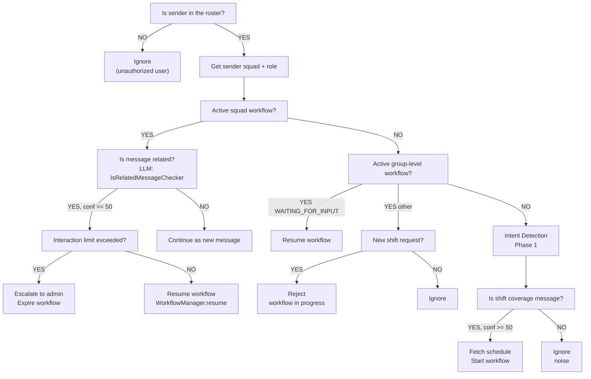
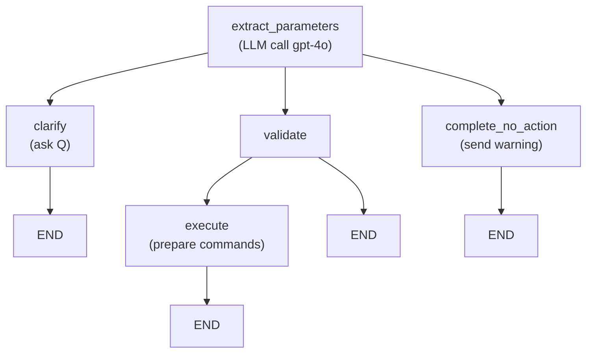
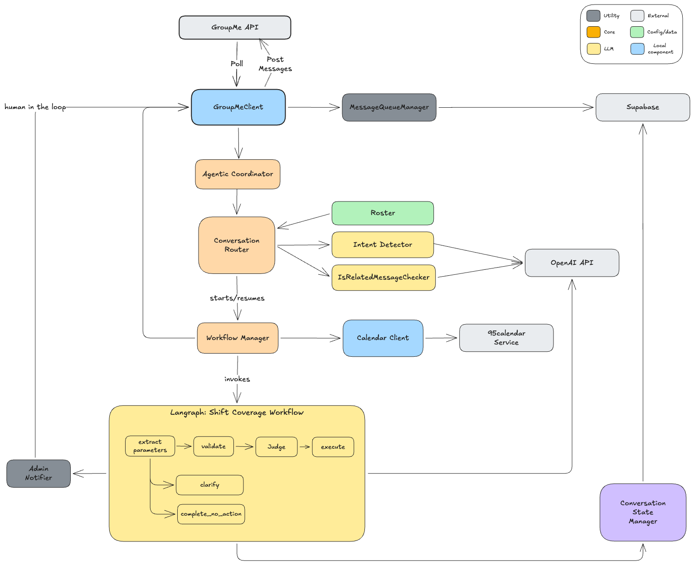

# Station 95 Schedule Chatbot — Developer Guide

## What This System Does

The Station 95 Collaborative is a group of 5 local EMS squads (34, 35, 42, 43, 54) that share overnight and weekend duty coverage. A shared calendar tracks which squads are on duty for each shift:

- **Weeknight shifts**: Monday–Friday, 1800–0600
- **Weekend shifts**: Saturday and Sunday, split into day (0600–1800) and night (1800–0600)

Each shift has one or two squads on duty (up to 4), and the 5 service territories are divided among whichever squads are covering.

Squad representatives coordinate schedule changes through a **GroupMe group chat** — messages like _"42 can't make it tonight"_ or _"54 is adding a crew for Saturday night."_ This chatbot monitors that GroupMe chat, interprets the scheduling intent, and automatically updates the shared calendar via API calls.

The chat also contains non-scheduling chatter (social messages, questions, etc.) which the chatbot silently ignores. When a message is ambiguous, the chatbot asks clarifying questions in the group chat and waits for a response. If the conversation becomes too complex (too many back-and-forth clarifications), it escalates to a human admin.

---

## High-Level Use Cases

1. **Squad reports no crew** — _"42 doesn't have a crew for tonight"_ → chatbot removes Squad 42 from tonight's shift on the calendar.

2. **Squad adds a crew** — _"54 is adding for Saturday night"_ → chatbot adds Squad 54 to Saturday night's shift.

3. **Ambiguous message requiring clarification** — _"We can't make it"_ → chatbot asks _"Which squad won't be available?"_ and waits for a reply.

4. **Multi-action message** — _"42 is out tonight and tomorrow"_ → chatbot processes both calendar changes in a single workflow.

5. **Noise filtering** — _"Great job tonight everyone!"_ → chatbot ignores this completely.

6. **Schedule conflict detection** — _"42 is out tonight"_ but Squad 42 isn't on tonight's schedule → chatbot reports the discrepancy as a warning rather than blindly modifying the calendar.

---

## Architecture Overview

The system is a **poll-based, stateful agentic chatbot** that runs on a cron schedule (not a long-running server). Each poll cycle:

1. Fetches new messages from GroupMe
2. Queues them for processing
3. Runs each message through an NLP pipeline (LLM-backed)
4. Executes calendar updates as needed
5. Persists all state to Supabase so it can resume across poll cycles

### Alternate note
The agent can be installed as a web callback we it is accessible from the internet.  This can be done either by exposing a URL from an AWS hosted zone.  If hosting server on a local environment, the webhook can be exposed using a reverse proxy solution (like `Cloudflare`).

## Implementation details (Subject to change)
- **Developer tools**
    - Visual Studio Code
    - AI: Claude code
- **Language details**
    - Python and/or GO
- **Database**
    - Supabase
- **Deployment**
    - Deploy to Docker
- **Reverse Proxy**
    - Cloudflare

---
### External Services

| Service | Purpose |
|---------|---------|
| **GroupMe API** | Message source (polling) and message output (bot replies) |
| **OpenAI API** | LLM for intent detection (gpt-4o-mini) and parameter extraction (gpt-4o) |
| **Supabase** | Persistent storage for conversations, workflows, and message queue |
| **Calendar Service** | HTTP API for reading/modifying the shared schedule [95calendar](https://github.com/intellectcubed/95calendar)|

### Key Design Principles

- **`poll_messages.py` is stateless** — all state lives in Supabase
- **LangGraph manages workflow logic, not persistence** — state is serialized externally
- **Two-phase LLM approach** — a cheap/fast model classifies messages, a capable model extracts parameters
- **Squad-scoped workflows** — each squad can have one active workflow at a time
- **Workflows survive restarts** — active workflows are restored from the database on startup

---

## Message Processing Flow

This section traces the lifecycle of a message from GroupMe through the system. Each subsection notes the class and file where the logic lives.

### 1. Polling and Queueing

**`GroupMePoller.poll()`** — `src/groupme_poller.py`

A cron job invokes `python -m src.poll_messages`, which calls `GroupMePoller.poll()`. The poller:

1. **Acquires a file-based lock** (`PollerLock` in `src/poller_lock.py`) to prevent concurrent polling. If another poller is running, this invocation yields immediately. Stale locks (older than 30 minutes) are auto-overridden and trigger an admin notification.

2. **Fetches messages** from the GroupMe API (up to 100 per call), filtering out messages already seen by comparing against a persisted `last_message_id` stored in `data/last_message_id.txt`.

3. **Filters** out system messages, bot messages, and the chatbot's own messages.

4. **Handles impersonation** (testing feature): messages prefixed with `{{@username}}` are treated as if sent by that roster member. This allows a developer to test as any squad rep.

5. **Inserts** each new message into the **message queue** (`MessageQueueManager` in `src/message_queue_manager.py`, backed by a Supabase `message_queue` table) with status `PENDING`.

6. **Processes** all `PENDING` messages sequentially, passing each to `AgenticCoordinator.process_message()`. On success, the queue entry is marked `DONE`; on failure, `FAILED` with a retry count. After 3 failures, an admin is notified.

7. **Expires** old queue entries (>24 hours) and **releases the lock**.

### 2. Coordination

**`AgenticCoordinator.process_message()`** — `src/agentic_coordinator.py`

The coordinator is the single entry point for processing. It:

1. Converts the `GroupMeMessage` into a `ConversationMessage` (the internal model)
2. Delegates to `ConversationRouter.route_message()` for all routing decisions
3. Stores the message in the Supabase `conversations` table (with `workflow_id` if one was assigned)

On startup, the coordinator also expires old workflows and restores active ones from the database.

### 3. Routing

**`ConversationRouter.route_message()`** — `src/conversation_router.py`

This is where the core decision tree lives. For each incoming message:



### 4. Intent Detection (Phase 1 — Is This a Scheduling Message?)

**`detect_intent()`** — `src/intent_detector.py`

This is the "noise filter." It uses a **fast, cheap LLM call (gpt-4o-mini)** with a carefully crafted prompt (`ai_prompts/IntentDetectionPrompt.md`) to determine two things:

1. **Is this a shift coverage message?** (boolean + confidence score 0–100)
2. **What date(s) is it about?** (resolved to exact `YYYY-MM-DD` values)

---

### 5. Date Resolution Strategy

Natural language date expressions (e.g., “today”, “next Tuesday”, “last Tuesday of the month”) are inherently ambiguous and cannot be reliably resolved by an LLM alone. To ensure accuracy and determinism, the system uses a **hybrid approach combining code and LLM**.

#### Approach

**1. Deterministic Parsing (Primary)**

* A Python-based parser extracts and resolves known date patterns:

  * `today`, `tomorrow`, `next <weekday>`, `last <weekday> of month`, etc.
* Resolution is based on the **current system date**
* Produces consistent, testable, and predictable results

**2. LLM-Assisted Resolution (Fallback)**

* Invoked only when deterministic parsing fails or is ambiguous
* A **code-generated date context (lookup table)** is provided to the LLM
* The LLM selects the most appropriate date from this constrained set (does not generate arbitrary dates)

**3. Confidence Handling**

* If LLM confidence is **low or ambiguous**:

  * Do **not** assume a date
  * Prompt the user for clarification

#### Priority

1. Deterministic parser (authoritative)
2. LLM fallback (constrained, best-effort)
3. User clarification (if confidence is insufficient)

#### Goal

* Ensure **deterministic and accurate date resolution**
* Minimize reliance on LLM for core logic
* Prevent incorrect assumptions through explicit clarification when needed

---

### 6. Schedule Fetching

**`ConversationRouter`** 

Before starting a workflow, the router fetches the current schedule for the resolved date:

```python
resolved_day = intent["resolved_days"][0]       # "2026-01-03"
date_yyyymmdd = resolved_day.replace("-", "")    # "20260103"
schedule_state = self.calendar_client.get_schedule(
    start_date=date_yyyymmdd, end_date=date_yyyymmdd
)
```

This schedule data is passed into the workflow so the LLM has full context of who is currently on duty.

### 7. Workflow Execution (Phase 2 — Parameter Extraction)

**`WorkflowManager.start_workflow()`** → LangGraph graph — `src/workflow_manager.py` and `src/workflows/shift_coverage.py`

The workflow manager creates a `Workflow` record in Supabase, then invokes the LangGraph state graph. The graph has 5 nodes:



**Node details:**

| Node |  What It Does |
|------|-------------|
| `extract_parameters_node` | Calls gpt-4o with the message, schedule CSV, and resolved dates. The system prompt (`ai_prompts/system_prompt.md`) instructs the LLM to return structured JSON with `parsed_requests` (list of actions), `missing_parameters`, and `warnings`. |
| `request_clarification_node` | Picks the highest-priority missing parameter and generates a question (e.g., _"Which squad won't be available?"_). Sets `clarification_question` in state. |
| `validate_parameters_node` |  Pure code validation: checks squad is in [34,35,42,43,54], date is YYYYMMDD, times are HHMM. |
| `execute_command_node` |  Builds `CalendarCommand` objects from `parsed_requests`. Does not execute — just prepares them. |
| `complete_no_action_node` | Handles cases where no calendar change is needed (e.g., squad isn't on the schedule). Sends the LLM's warnings/reasoning to the chat. |

**Routing logic between nodes:**
- After extraction: 0 actions → `complete_no_action` | missing params → `clarify` | otherwise → `validate`
- After validation: passed → `execute` | failed → `END`

### 8. Handling Workflow Outputs

**`WorkflowManager._handle_workflow_outputs()`** 

After the LangGraph graph completes a step, the workflow manager inspects the resulting state and:

- **If `clarification_question` is set**: sends it to GroupMe, marks workflow `WAITING_FOR_INPUT`
- **If `validation_warnings` exist**: sends each as a warning to GroupMe
- **If `execution_result.status == "prepared"`**: executes each `CalendarCommand` via `CalendarClient.send_command_with_retry()` (up to 3 retries with backoff), sends a confirmation message, marks workflow `COMPLETED`

Here’s the updated version with that consideration added, still concise and spec-ready:

---

### 9. Resuming a Paused Workflow

**`WorkflowManager.resume_workflow()`**

When a new message is received, the system first determines whether it is a response to an existing workflow using `is_message_related_to_workflow()`.

To make this determination:

1. The system retrieves the **last N messages (e.g., 30)** from Supabase (`conversations` table), scoped to the relevant chat/workflow and ordered chronologically. Only **recent messages (e.g., within the last 24 hours)** are considered, as responses to clarifications are expected to occur shortly after the original prompt.
2. These messages, along with the **incoming message** and **active workflow metadata**, are passed to a lightweight LLM (`gpt-4o-mini`).
3. The LLM returns `{ is_related, confidence }`, indicating whether the new message is part of the existing conversation.

If `is_related = true` and confidence meets the threshold:

1. The original request and the new message are **combined into a single enriched input**
2. The LangGraph workflow is **re-invoked from `extract_parameters`**
3. The workflow proceeds normally (validate → execute or request further clarification)

If not, the message is treated as a new request.


---

## Data Models

**`src/models.py`**

| Model | Purpose |
|-------|---------|
| `GroupMeMessage` | Raw message from GroupMe API |
| `ConversationMessage` | Message stored in Supabase `conversations` table |
| `Workflow` | Workflow record in Supabase `workflows` table |
| `WorkflowStateData` | Typed structure for the workflow's `state_data` JSONB column |
| `MessageQueue` | Entry in Supabase `message_queue` table |
| `CalendarCommand` | Command to send to the calendar service |
| `LLMAnalysis` | Structured LLM response |

### Calendar Actions

| Action | Meaning |
|--------|---------|
| `noCrew` | Squad cannot provide coverage — remove from schedule |
| `addShift` | Squad is committing coverage — add to schedule |
| `obliterateShift` | Remove shift entirely (rare) |

### Workflow Statuses

```
NEW → WAITING_FOR_INPUT → READY → EXECUTING → COMPLETED
                │                                  ↑
                └──────────────────────────────────┘
                        (or → EXPIRED at any point)
```

---

## Configuration

**`src/config.py`** — Pydantic `Settings` class loading from `.env`

### Required Environment Variables

| Variable | Purpose |
|----------|---------|
| `SUPABASE_URL` | Supabase project URL |
| `SUPABASE_KEY` | Service role key (bypasses RLS) |
| `OPENAI_API_KEY` | OpenAI API key |
| `GROUPME_API_TOKEN` | GroupMe API token for reading messages |
| `GROUPME_GROUP_ID` | GroupMe group to monitor |
| `GROUPME_BOT_ID` | GroupMe bot ID for sending messages |
| `CALENDAR_SERVICE_URL` | Base URL of the calendar HTTP service |

### Key Tuning Parameters

| Variable | Default | Purpose |
|----------|---------|---------|
| `CONFIDENCE_THRESHOLD` | 70 | Minimum confidence for intent detection |
| `WORKFLOW_EXPIRATION_HOURS` | 24 | Time before a workflow auto-expires |
| `WORKFLOW_INTERACTION_LIMIT` | 2 | Max clarification rounds before admin escalation |
| `POLLER_TIMEOUT_MINUTES` | 30 | Stale lock detection threshold |
| `MAX_RETRY_ATTEMPTS` | 3 | Message processing retries before admin notification |
| `ENABLE_USER_IMPERSONATION` | true | Testing feature: `{{@name}}` prefix |
| `ENABLE_GROUPME_POSTING` | true | Set false for dry-run (log only) |

---

## LLM Prompts

All prompts live in `ai_prompts/` and are loaded from disk at runtime.

| File | Used By | Model | Purpose |
|------|---------|-------|---------|
| `IntentDetectionPrompt.md` | `intent_detector.py` | gpt-4o-mini | Classify message as shift-related or noise; resolve dates |
| `system_prompt.md` | `shift_coverage.py` | gpt-4o | Extract structured parameters from message + schedule context |
| `IsRelatedMessagePrompt.md` | `is_related_message_checker.py` | gpt-4o-mini | Determine if a new message continues an existing conversation |

---

## Frameworks and Libraries

| Library | Version | Role |
|---------|---------|------|
| **LangChain** | 0.3.13 | LLM abstraction layer (ChatOpenAI, message types) |
| **LangGraph** | 0.2.60 | Workflow state graph framework (nodes, edges, conditional routing). [Docs](https://langchain-ai.github.io/langgraph/) |
| **langchain-openai** | 0.2.14 | OpenAI-specific LangChain integration |
| **Supabase** | 2.10.0 | Python client for Supabase (Postgres + REST API) |
| **Pydantic** | 2.10.4 | Data validation and settings management |
| **Requests** | 2.32.3 | HTTP client for GroupMe and calendar APIs |

---

## Deployment

The system runs as a **cron-scheduled Docker container**:

- **Dockerfile**: Python 3.11 slim image with cron installed
- **Entrypoint**: Starts cron in the foreground
- **Volumes**: `data/` (state files), `logs/` (log files)
- **Invocation**: Each cron tick runs `python -m src.poll_messages`

For local development:
```bash
# Single poll cycle
python -m src.poll_messages

# Continuous polling (every N seconds)
./scripts/poller_repl.sh 30
```

---

## Logging

**`src/logging_config.py`**

| Logger | Output File | Content |
|--------|------------|---------|
| Root | `chatbot.log` | All application logs |
| `llm` | `llm.log` | Full LLM request/response payloads |
| `groupme` | `groupme.log` | All messages received from and sent to GroupMe |
| `calendar` | `calendar.log` | All calendar service requests and responses |
| Errors | `errors.log` | ERROR-level entries only |

---

## Error Handling and Resilience

| Mechanism | Component | Behavior |
|-----------|-----------|----------|
| Concurrent poll prevention | `PollerLock` | File-based lock; stale lock auto-override + admin notification |
| Message retry | `MessageQueueManager` | Failed messages retried up to 3 times; admin notified on exhaustion |
| Workflow expiration | `ConversationStateManager` | Workflows older than 24 hours auto-expire on next startup |
| Escalation | `ConversationRouter` | After 2 clarification rounds, escalates to admin via DM and expires the workflow |
| Calendar retry | `WorkflowManager` | Calendar commands retried up to 3 times with exponential backoff |
| Dry-run mode | `GroupMeClient` | `ENABLE_GROUPME_POSTING=false` logs messages without sending |
| Admin DMs | `admin_notifier.py` | Sends direct messages to a configured admin GroupMe user |

---
## Component Overview




