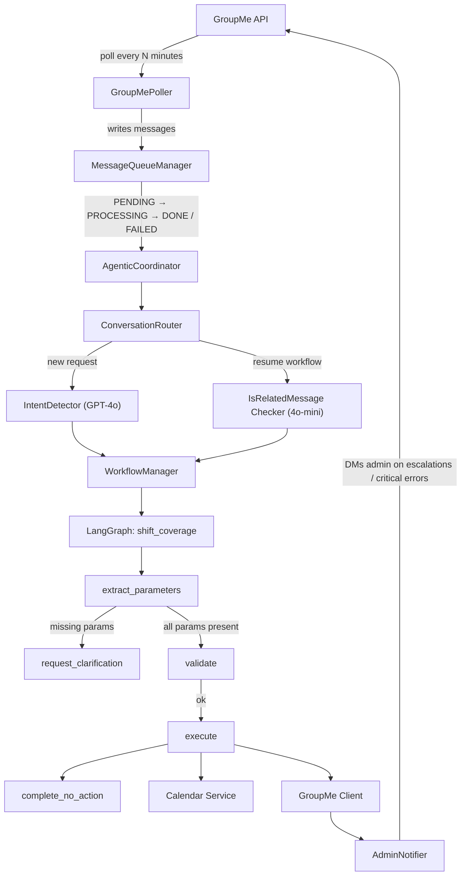

# Station 95 Schedule Chatbot — Overview

## What It Does

A GroupMe chatbot that listens for shift coverage requests from EMS squad members and executes the corresponding schedule changes against a calendar service. It uses an AI-driven workflow to handle natural language requests, ask clarifying questions when needed, and confirm before acting.

---

## High-Level Requirements

### Functional Requirements

| # | Requirement |
|---|-------------|
| R1 | Poll a GroupMe group chat for new messages on a recurring interval |
| R2 | Identify when a message is a shift coverage request (vs. unrelated chatter) |
| R3 | Extract scheduling parameters: squad, date, shift start/end times, and action type |
| R4 | Ask the user one clarifying question at a time when parameters are ambiguous or missing |
| R5 | Validate the requested change against the current schedule before executing |
| R6 | Execute calendar commands (`noCrew`, `addShift`, `obliterateShift`) via the calendar service |
| R7 | Confirm the outcome back to the GroupMe group |
| R8 | Support multiple squads running independent workflows simultaneously |
| R9 | Recognize when a follow-up message belongs to an in-progress workflow (not a new request) |
| R10 | Escalate to an admin and stop the workflow after too many clarification rounds |
| R11 | Persist all workflow state so it survives restarts |
| R12 | Queue all incoming messages for reliable, at-least-once processing with retry |
| R13 | Notify admin via GroupMe DM on critical failures (stale lock, max retries, workflow errors) |
| R14 | Support a dry-run mode that logs without posting to GroupMe |
| R15 | Support user impersonation in GroupMe messages for testing |

### Non-Functional Requirements

- **Reliability**: No messages lost; message queue with up to 3 retries before escalation
- **Concurrency safety**: File-based poller lock prevents duplicate processing
- **Observability**: Separate log streams for app, LLM calls, GroupMe API, and calendar API
- **Deployability**: Runs in Docker with cron-scheduled polling (default: every 2 minutes)
- **Configurability**: All behavior tunable via environment variables; prompts externalized to `.md` files

---

## General Flow Overview

<div style="width: 600px;">


</div>

### State Persistence

All workflow and message state lives in **Supabase (PostgreSQL)**:

| Table | Purpose |
|---|---|
| `message_queue` | Incoming message buffer with retry tracking |
| `conversations` | Full message history for audit / context |
| `workflows` | Workflow instances + serialized LangGraph state (JSONB) |

Workflows survive container restarts; the coordinator reloads `WAITING_FOR_INPUT` workflows on startup.

---

## Key Components

| Component | File | Role |
|---|---|---|
| **GroupMePoller** | `src/groupme_poller.py` | Fetches messages, queues them, drives processing loop |
| **PollerLock** | `src/poller_lock.py` | File-based mutex; detects stale locks (>30 min) |
| **MessageQueueManager** | `src/message_queue_manager.py` | Persistent queue with retry + expiry logic |
| **AgenticCoordinator** | `src/agentic_coordinator.py` | Top-level orchestrator; restores state on startup |
| **ConversationRouter** | `src/conversation_router.py` | Decides whether to start/resume/ignore a workflow |
| **IntentDetector** | `src/intent_detector.py` | GPT-4o: classifies message as shift request + resolves date |
| **IsRelatedMessageChecker** | `src/is_related_message_checker.py` | GPT-4o-mini: checks if reply belongs to active workflow |
| **WorkflowManager** | `src/workflow_manager.py` | Manages LangGraph lifecycle; sends GroupMe replies |
| **shift_coverage workflow** | `src/workflows/shift_coverage.py` | LangGraph state machine implementing the request logic |
| **CalendarClient** | `src/calendar_client.py` | HTTP client for the external calendar service |
| **GroupMeClient** | `src/groupme_client.py` | Sends group messages and admin DMs |
| **ConversationStateManager** | `src/conversation_state_manager.py` | CRUD against Supabase tables |
| **AdminNotifier** | `src/admin_notifier.py` | Sends critical alerts to admin via GroupMe DM |

---

## Message Routing Logic

```
Incoming message
  │
  ├─ Not on roster? → ignore
  │
  ├─ Active workflow for sender's squad?
  │     ├─ IsRelated = yes → resume workflow
  │     ├─ IsRelated = no  → ignore (unrelated chatter)
  │     └─ interaction_count ≥ limit → escalate to admin, expire workflow
  │
  └─ No active workflow?
        ├─ IntentDetector: is shift request? → start new workflow
        └─ Not a shift request → ignore
```

---

## Workflow State Machine

```
NEW
 │
 ▼
extract_parameters ──(missing params)──► request_clarification
 │                                              │
 │◄─────────────────(user replies)─────────────┘
 │
 ▼
validate ──(conflict/warnings)──► request_clarification
 │
 ▼
execute ──► COMPLETED

Any node ──(no action needed)──► complete_no_action ──► COMPLETED
```

**Workflow statuses**: `NEW` → `WAITING_FOR_INPUT` → `READY` → `EXECUTING` → `COMPLETED` / `EXPIRED`

---

## External Integrations

| Service | Purpose | Protocol |
|---|---|---|
| **GroupMe API** | Read group messages, post bot replies, send admin DMs | REST/HTTP |
| **Calendar Service** | Query and mutate shift schedule | REST/HTTP (`?action=noCrew\|addShift\|obliterateShift&date=YYYYMMDD&...`) |
| **OpenAI** | Intent detection (GPT-4o), workflow reasoning (GPT-4o), related-message check (GPT-4o-mini) | OpenAI SDK via LangChain |
| **Supabase** | Workflow state, message queue, conversation history | Supabase Python SDK |

---

## Deployment

The system is packaged as a Docker container with an internal cron job:

```
docker-compose up -d
```

The container runs `python -m src.poll_messages` on a configurable interval (default: 2 minutes). Volumes mount `data/` (poller state, roster, lock file) and `logs/` for persistence outside the container.

For local development, use `./scripts/poller_repl.sh [INTERVAL_SECONDS]` for continuous polling or `./scripts/poll.sh` for a single run.

---

## Configuration Reference

All settings are environment variables (`.env` file or container env). See `.env.template` for the full list. Critical required variables:

```
SUPABASE_URL, SUPABASE_KEY
OPENAI_API_KEY
GROUPME_API_TOKEN, GROUPME_GROUP_ID, GROUPME_BOT_ID
CALENDAR_SERVICE_URL
ADMIN_GROUPME_USER_ID
```

Key behavioral tuning:

```
CONFIDENCE_THRESHOLD=70          # Intent detection threshold (0-100)
WORKFLOW_INTERACTION_LIMIT=2     # Clarification rounds before escalation
WORKFLOW_EXPIRATION_HOURS=24     # Workflow TTL
MAX_RETRY_ATTEMPTS=3             # Message queue retries before admin alert
ENABLE_GROUPME_POSTING=true      # false = dry-run mode
ENABLE_USER_IMPERSONATION=true   # Prefix messages with {{@username}} for testing
```

## Database Schema 

### 1. Message Queue Table

```sql
CREATE TABLE message_queue (
    id UUID PRIMARY KEY DEFAULT gen_random_uuid(),
    message_id TEXT UNIQUE NOT NULL,  -- GroupMe message ID
    group_id TEXT NOT NULL,
    user_id TEXT NOT NULL,
    user_name TEXT NOT NULL,
    message_text TEXT NOT NULL,
    timestamp BIGINT NOT NULL,  -- GroupMe timestamp
    status TEXT NOT NULL DEFAULT 'RECEIVED',  -- RECEIVED|PENDING|PROCESSING|DONE|FAILED|EXPIRED|SKIPPED
    retry_count INTEGER DEFAULT 0,
    error_message TEXT,
    created_at TIMESTAMP DEFAULT NOW(),
    updated_at TIMESTAMP DEFAULT NOW(),
    processed_at TIMESTAMP
);

CREATE INDEX idx_message_queue_status ON message_queue(status) WHERE status IN ('PENDING', 'PROCESSING', 'FAILED');
CREATE INDEX idx_message_queue_created ON message_queue(created_at);
```

### 2. Workflows Table

```sql
ALTER TABLE workflows ADD COLUMN user_id TEXT;
ALTER TABLE workflows ADD COLUMN squad_id INTEGER;

CREATE INDEX idx_workflows_squad_status ON workflows(squad_id, status)
WHERE status IN ('NEW', 'WAITING_FOR_INPUT', 'READY', 'EXECUTING');
```

**Note:** `user_id` and `squad_id` are nullable and should be populated when available (from roster lookup).